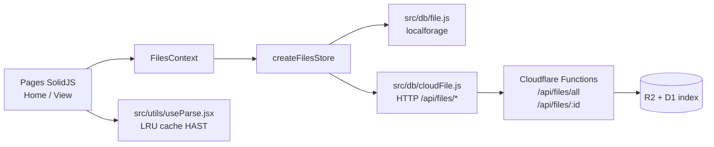
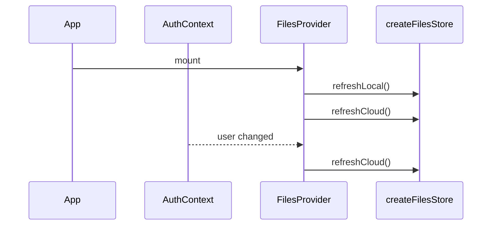
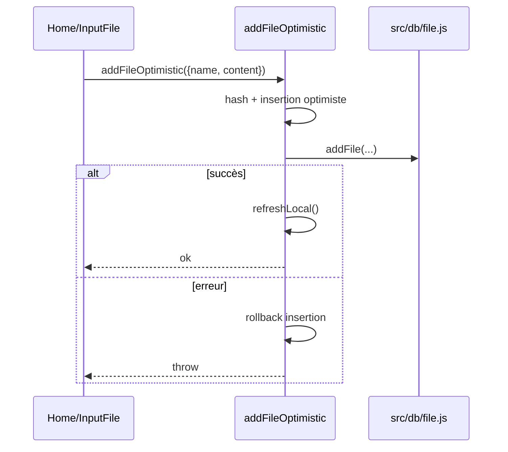
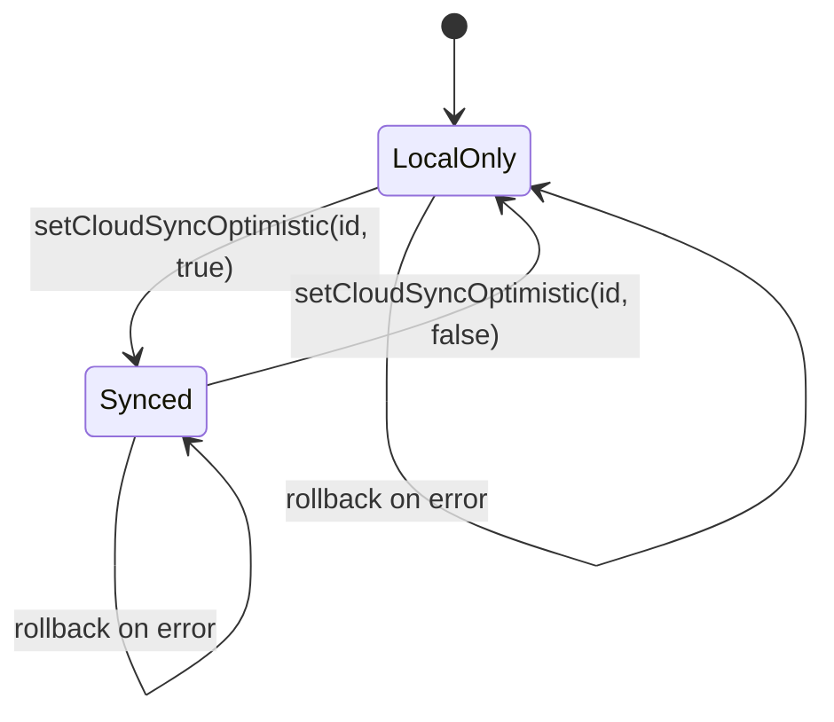

# Hook de cache fichiers + opérations optimistes

Ce document explique la couche introduite autour de `useFilesStore` pour gérer :

- un **store normalisé local/cloud**,
- des **mutations optimistes avec rollback**,
- un **cache de parsing HAST** pour accélérer la réouverture des fichiers.

L’objectif est d’avoir un comportement fluide côté UI tout en gardant une source de vérité cohérente.

---

## 1) Vue d’ensemble



Points clés :

- `FilesContext` expose un store partagé entre pages.
- `createFilesStore` maintient des structures normalisées (`byId`, `order`).
- Les actions `add/remove/sync/update` appliquent une mise à jour optimiste puis rollback si erreur.
- `toHAST` met en cache les AST/HAST en mémoire avec éviction LRU par budget de taille.

---

## 2) Où se trouve quoi

- Store métier : `src/utils/useFilesStore.js`
- Provider + hook d’accès : `src/context/FilesContext.jsx`
- Intégration UI (liste/actions fichiers) : `src/pages/Home.jsx`
- Intégration lecture fichier : `src/pages/View.jsx`
- Local DB : `src/db/file.js`
- Cloud adapter : `src/db/cloudFile.js`
- Parse + cache HAST : `src/utils/useParse.jsx`
- Backend metadata cloud : `functions/utils/db/filesR2.js`

---

## 3) Contrat du store

Le store expose principalement :

```js
{
    localFiles,          // memo: array ordonné des metadata locales
    cloudFiles,          // memo: array ordonné des metadata cloud
    cloudIds,            // memo: Set(id) cloud
    isPending(id),       // statut mutation optimiste en cours
    isLoadingLocal,      // signal de chargement local
    isLoadingCloud,      // signal de chargement cloud
    refreshLocal(),
    refreshCloud(),
    addFileOptimistic({ name, content }),
    removeLocalOptimistic(id),
    setCloudSyncOptimistic(id, enabled),
    updateFileOptimistic(id, patch),
    getFileFromAnyStorage(id)
}
```

### Structure interne normalisée

```js
{
    localById: {},
    localOrder: [],
    cloudById: {},
    cloudOrder: [],
    pendingById: {}
}
```

Pourquoi normaliser :

- update ciblé par `id` en O(1),
- ordre de rendu indépendant,
- rollback simple via snapshot des maps/listes.

---

## 4) Cycle de vie du provider



`FilesProvider` est branché sous `AuthProvider`, ce qui permet de faire dépendre le cloud de l’état utilisateur (`user()?.id`).

---

## 5) Opérations optimistes (avec rollback)

## 5.1 Ajouter un fichier (local)



Extrait simplifié :

```js
setState('localById', id, optimistic);
setState('localOrder', (prev) => [...prev, id]);

try {
    await addFile({ name, content });
    await refreshLocal();
} catch (error) {
    setState('localOrder', (prev) => prev.filter((entryId) => entryId !== id));
    setState('localById', id, undefined);
    throw error;
}
```

## 5.2 Supprimer un fichier local

Stratégie : snapshot avant mutation, suppression optimiste immédiate, restauration snapshot en cas d’échec.

```js
const snapshot = {
    localById: { ...state.localById },
    localOrder: [...state.localOrder]
};

setState('localOrder', (prev) => prev.filter((entryId) => entryId !== id));
setState('localById', id, undefined);

try {
    await removeLocalFile(id);
} catch (error) {
    applyLocalSnapshot(setState, snapshot);
    throw error;
}
```

## 5.3 Sync cloud on/off

- `enabled=true` : ajout optimiste côté cloud + `storeCloudFile`.
- `enabled=false` : retrait optimiste + `removeCloudFile`.
- rollback cloud via snapshot dédié.



## 5.4 Update (rename/content)

`updateFileOptimistic` gère aussi le cas où l’ID change (hash du contenu), avec migration optimiste `id -> nextId` sur local et cloud.

---

## 6) Résolution de lecture (View)

`View` ne lit plus directement les adapters : il passe par le store.

```js
const { getFileFromAnyStorage } = useFiles();
const [file] = createResource(() => params.id, getFileFromAnyStorage);
```

Ordre de résolution :

1. local (`getLocalFile`),
2. fallback cloud (`getCloudFile`).

---

## 7) Cache HAST (parse markdown/html)

Le parseur `toHAST` utilise un cache en mémoire `Map` avec :

- clé : `${type}:${text}`,
- taille estimée via `TextEncoder` sur le texte source,
- éviction LRU tant que `parseCacheSize > DEFAULT_CACHE_MAX_BYTES`.

```mermaid
flowchart TD
    A[toHAST(text, type)] --> B{cache hit ?}
    B -- yes --> C[return structuredClone(cached)]
    B -- no --> D[parse markdown/html]
    D --> E[writeToCache(key, value, size)]
    E --> F{size budget exceeded ?}
    F -- yes --> G[evict oldest entries]
    F -- no --> H[keep cache]
    G --> I[return structuredClone(value)]
    H --> I
```

Extrait simplifié :

```js
while (parseCacheSize > DEFAULT_CACHE_MAX_BYTES && parseCache.size > 0) {
    const firstKey = parseCache.keys().next().value;
    const removed = parseCache.get(firstKey);
    parseCache.delete(firstKey);
    parseCacheSize -= removed?.size || 0;
}
```

Pourquoi `structuredClone` : éviter qu’un consumer modifie la référence interne du cache.

---

## 8) Contrat API cloud utile au hook

Côté frontend (`src/db/cloudFile.js`) :

- `GET /api/files/all` → metadata cloud,
- `GET /api/files/:id` → contenu fichier,
- `POST /api/files/:id` → upsert cloud,
- `DELETE /api/files/:id` → suppression cloud.

Côté backend (`functions/utils/db/filesR2.js`) :

- metadata inclut désormais `updatedAt` en plus de `createdAt`, utile pour tri/réconciliation.

Extrait SQL :

```sql
SELECT
    file_id AS id,
    name,
    size,
    created_at AS createdAt,
    updated_at AS updatedAt
FROM files_index
WHERE user_id = ?
ORDER BY updated_at DESC
```

---

## 9) Intégration UI actuelle

Dans `Home` :

- import fichier → `addFileOptimistic`,
- suppression locale → `removeLocalOptimistic`,
- checkbox sync cloud → `setCloudSyncOptimistic`.

Dans `View` :

- chargement fichier via store,
- parse markdown via `toHAST` (cache LRU actif).

---

## 10) Limites connues / choix de design

- Cache HAST en mémoire process navigateur uniquement (pas persistant).
- Clé du cache basée sur le texte complet (simple, robuste, mais potentiellement coûteux sur très gros documents).
- `getCloudFilesMetadata()` retourne `[]` en 401 (choix actuel de tolérance UI).
- Rollback est immédiat (pas de queue de retry automatique en V1).

---

## 11) Extension recommandée

Prochaines évolutions possibles :

1. Ajouter un statut de sync dérivé (`local-only`, `synced`, `out-of-sync`).
2. Ajouter une stratégie retry optionnelle par mutation.
3. Exposer métriques du cache parse (`hit/miss`, taille courante).
4. Ajouter invalidation fine du cache parse sur update ciblé.
5. Introduire tests unitaires Vitest sur la logique de rollback/store.

---

## 12) Check-list manuelle de validation

- Import d’un `.md` → entrée locale immédiate.
- Échec simulé d’écriture locale/cloud → rollback visible.
- Toggle sync cloud on/off → liste cloud cohérente après refresh.
- Rename/update content (quand branché en UI) → migration id gérée.
- Ouverture répétée d’un même fichier dans `View` → parse plus rapide (cache hit).
