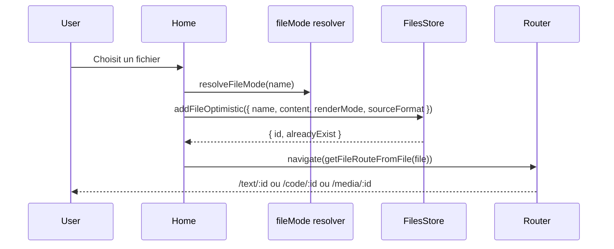

# Implémentation — récapitulatif des changements

Date: 2026-02-18

Ce document résume les changements livrés pour:
- accepter des fichiers texte/code (pas seulement `.md`),
- préparer des vues distinctes selon le type de fichier,
- corriger les erreurs Mermaid qui fuyaient hors du layout.

---

## 1) Objectifs réalisés

### Ingestion fichiers
- L’input web accepte maintenant les fichiers texte/code.
- Les formats binaires évidents sont bloqués (ex: `.pdf`, `.zip`, `.mp4`, etc.).
- La CLI `texte-upload` scanne et envoie des fichiers texte/code, plus uniquement `.md`.

### Routage mode-driven
- Ajout des routes:
  - `/text/:id`
  - `/code/:id`
  - `/media/:id`
- Compatibilité conservée avec `/view/:id` via redirection automatique.

### Rendu et UX
- Vue texte: conserve le rendu markdown existant.
- Vue code: full-width + langage détecté.
- Vue media: placeholder structuré pour l’évolution future.

### Mermaid fix
- Validation Mermaid avant rendu.
- Suppression du rendu d’erreur natif Mermaid qui injectait du SVG parasite.
- Nettoyage des artefacts DOM éventuels.
- Message d’erreur normalisé et affiché uniquement dans le bloc.

---

## 2) Fichiers clés modifiés

### Frontend
- `src/utils/fileMode.js`
- `src/pages/Home.jsx`
- `src/App.jsx`
- `src/components/Layout.jsx`
- `src/pages/TextView.jsx`
- `src/pages/CodeView.jsx`
- `src/pages/MediaView.jsx`
- `src/pages/ViewRedirect.jsx`
- `src/utils/useFilesStore.js`
- `src/db/file.js`
- `src/db/cloudFile.js`
- `src/components/renderers/CodeBlock.jsx`

### Backend (Cloudflare Functions)
- `functions/api/files/[id].js`
- `functions/utils/db/filesR2.js`
- `functions/utils/files/fileMode.js`

### CLI
- `bin/texte-upload.js`

### Suivi
- `todo.md` (cases cochées pour les éléments réalisés)

---

## 3) Architecture (après)

```mermaid
flowchart TD
    A[Input file / CLI] --> B[resolveFileMode]
    B --> C[Metadata locale: sourceFormat + renderMode]
    C --> D[Stockage local]
    C --> E[Sync cloud API]
    E --> F[R2/D1]

    D --> G[Route resolver]
    F --> G
    G --> H[/text/:id]
    G --> I[/code/:id]
    G --> J[/media/:id]
    K[/view/:id] --> G
```

---

## 4) Routage par mode



---

## 5) Extraits de code

### Résolution du mode (frontend)

```js
export function resolveFileMode(name) {
    const extension = getExtensionFromName(name);

    if (!extension) {
        return { extension: '', sourceFormat: 'plain', renderMode: 'text' };
    }

    if (MEDIA_EXTENSIONS.has(extension)) {
        return { extension, sourceFormat: extension, renderMode: 'media' };
    }

    if (CODE_EXTENSIONS.has(extension)) {
        return { extension, sourceFormat: extension, renderMode: 'code' };
    }

    return { extension, sourceFormat: extension, renderMode: 'text' };
}
```

### Compatibilité `/view/:id`

```js
createEffect(() => {
    const entry = file();
    if (!entry?.id) return;
    navigate(getFileRouteFromFile(entry), { replace: true });
});
```

### Mermaid sécurisé

```js
mermaid.initialize({
    startOnLoad: false,
    suppressErrorRendering: true,
    theme: 'dark'
});

const validation = await validateMermaidSource(mermaid, content);
if (!validation.ok) {
    return { svg: null, error: validation.error || 'Syntax error' };
}

const { svg } = await mermaid.render(id, content);
cleanupMermaidArtifacts(id);
```

---

## 6) Vérifications manuelles recommandées

1. Importer `.md`, `.js`, `.ts`, `.py`, `.json` depuis Home.
2. Vérifier l’ouverture automatique dans la bonne route (`/text`, `/code`, `/media`).
3. Tester `/view/:id` pour confirmer la redirection vers la route mode-driven.
4. Tester un diagramme Mermaid invalide:
   - le message d’erreur doit rester dans le bloc,
   - aucun SVG d’erreur parasite ne doit apparaître hors layout.
5. Tester upload CLI sur un dossier mixte (texte + binaire) et vérifier que les binaires évidents sont ignorés.

---

## 7) Commandes utiles

### Upload de ce document avec la CLI

```bash
node bin/texte-upload.js docs/implementation-recap-2026-02-18.md
```

### Variante locale dev

```bash
node bin/texte-upload.js docs/implementation-recap-2026-02-18.md --url http://localhost:7000
```
