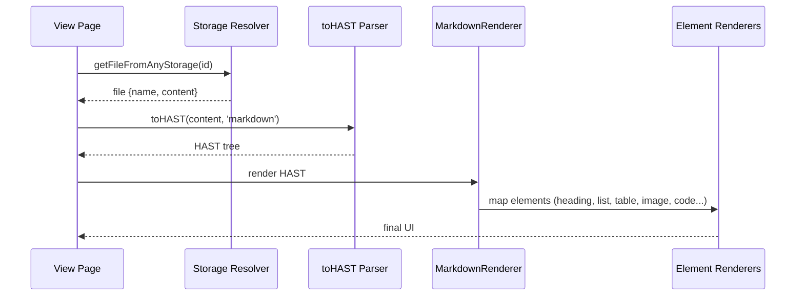
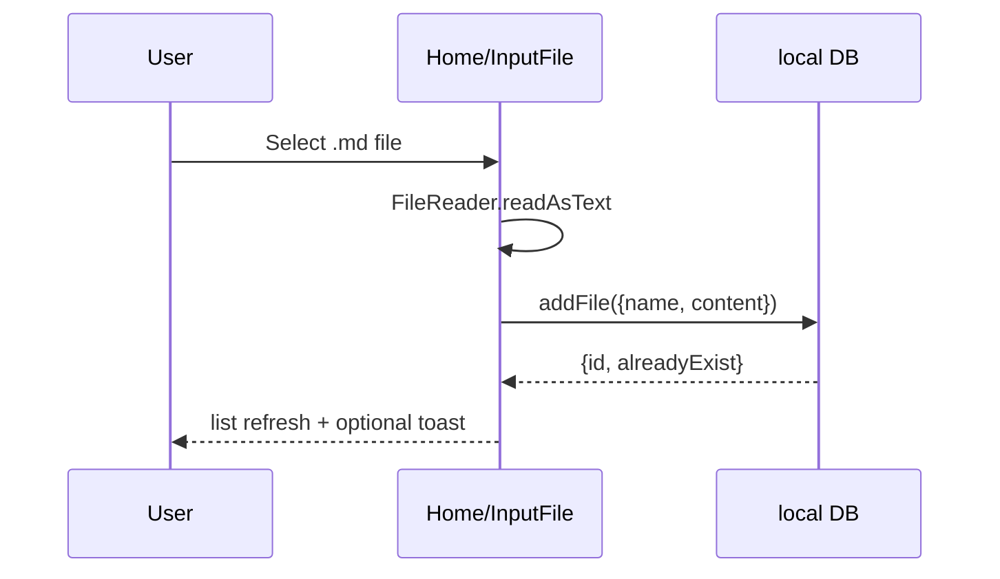
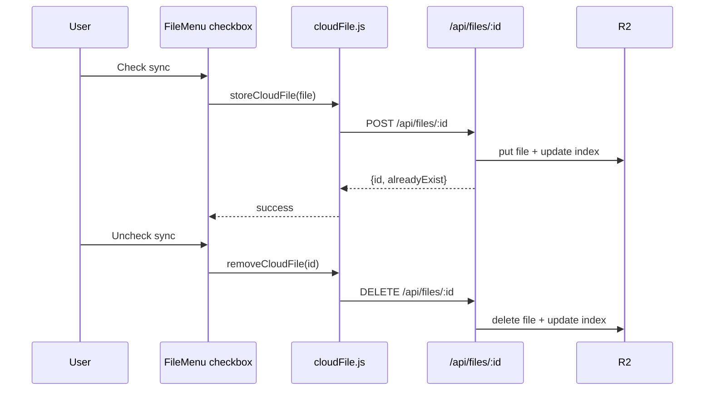
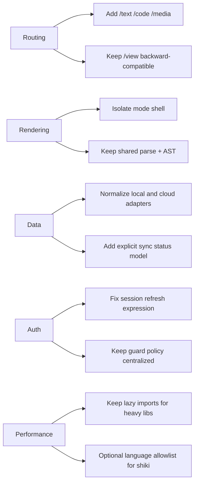

# Project State — Markdown / Texte

## Purpose

This document captures the **current architecture and runtime behavior** of the project, with a focus on:

- Frontend pages and rendering flow
- Hooks/utils responsibilities
- API surface and authentication model
- Local + cloud file storage behavior
- Current strengths, limitations, and next design-ready targets

---

## 1) System Overview

```mermaid
flowchart LR
    U[User Browser] --> R[Solid Router]
    R --> P1[Home Page]
    R --> P2[View Page]
    R --> P3[Login Page]

    P1 --> LDB[Local DB localforage]
    P1 --> CAPI[/api/files/*]
    P2 --> LDB
    P2 --> CAPI

    CAPI --> AUTH[requireAuth + session cookie]
    AUTH --> R2[(R2 FILES_BUCKET)]

    P3 --> OAUTH[/auth/login -> Google OAuth]
    OAUTH --> ACB[/auth/callback]
    ACB --> SES[(Session cookie)]

    U --> BADGE[Image badge fetch]
    BADGE --> BAPI[/api/badge]
```

---

## 2) Frontend Composition

## 2.1 Entry and Router

- `src/index.jsx`
  - mounts app
  - loads global styles
- `src/App.jsx`
  - wraps all routes with `AuthProvider`
  - routes:
    - `/` → `Home`
    - `/view/:id` → `View`
    - `/login` → `Login`
    - `/success` → `AuthSuccess`

## 2.2 Shell Layout

- `src/components/Layout.jsx`
  - top nav + auth-aware controls
  - renders route content in centered main container

## 2.3 Pages

### `Home` (`src/pages/Home.jsx`)

Current behavior:

- Displays two lists:
  - **Local** files (from localforage)
  - **Cloud** files (from R2 API if user is authenticated)
- Uses popover menu per local file:
  - Open
  - Open new tab
  - Toggle cloud sync via checkbox
  - Delete local file
- Imports `.md` via file input (FileReader)

Data sources:

- Local: `src/db/file.js`
- Cloud: `src/db/cloudFile.js`

### `View` (`src/pages/View.jsx`)

Current behavior:

- Fetch chain: local file first, fallback cloud file
- Parses content to HAST via `toHAST`
- Renders through `MarkdownRenderer`
- Sets dynamic document title + description:
  - `file.name` when present
  - fallback `Texte`

### `Login` + `AuthSuccess`

- `Login`: triggers OAuth popup (`/auth/login`)
- `AuthSuccess`: posts message to opener and closes popup

---

## 3) Rendering Pipeline



## 3.1 Parser utility

- `src/utils/useParse.jsx`
  - markdown: `remark-parse` + `remark-gfm` + `remark-rehype` + `rehype-raw`
  - html: `rehype-parse`

## 3.2 Renderer map

- `src/components/MarkdownRenderer.jsx`
  - routes HAST nodes to component renderers
  - handles element vs leaf renderer split
  - table/image attributes are forwarded to dedicated components

## 3.3 Code and media rendering

- `src/components/renderers/CodeBlock.jsx`
  - dynamic import for heavy libs:
    - `shiki`
    - `mermaid`
  - supports:
    - highlighted code
    - Mermaid diagrams with pan/zoom
    - copy to clipboard UX

---

## 4) State & Auth Model

## 4.1 Frontend auth context

- `src/context/AuthContext.jsx`
  - `user`, `loading`
  - `fetchUser` via `/auth/me`
  - `login()` opens popup
  - `logout()` calls `/auth/logout`
  - listens for `oauth-success` postMessage

## 4.2 Session flow

```mermaid
flowchart TD
    A[User clicks Login] --> B[/auth/login]
    B --> C[Google OAuth consent]
    C --> D[/auth/callback]
    D --> E[Validate state + id_token]
    E --> F[Whitelist email check]
    F --> G[Create signed session token]
    G --> H[Set HttpOnly cookie]
    H --> I[Redirect /success]
    I --> J[Popup posts oauth-success]
    J --> K[AuthContext refetch /auth/me]
```

## 4.3 Backend auth utilities

- `functions/utils/auth/*`
  - cookie creation/clear
  - token sign/verify (`sessionToken.js`)
  - auth extraction (`authenticate.js`)
  - route guard (`requireAuth.js`)

---

## 5) Storage Architecture

## 5.1 Local storage

- `src/db/file.js`
  - localforage store `md/files`
  - per-file entry by hashed id
  - metadata index key `__files_index__`
  - operations: add/get/remove/getFilesMetadata

## 5.2 Cloud storage (R2)

- Frontend API wrapper: `src/db/cloudFile.js`
- Backend routes:
  - `functions/api/files/all.js`
  - `functions/api/files/[id].js`
- Backend storage utility:
  - `functions/utils/db/filesR2.js`

R2 object layout:

```text
users/{userId}/files/index.json
users/{userId}/files/{id}.json
```

Per-file payload:

```json
{
  "id": "sha256...",
  "name": "example.md",
  "content": "# markdown...",
  "createdAt": 1739850000000,
  "updatedAt": 1739850000000
}
```

Index payload:

```json
[
  {
    "id": "sha256...",
    "name": "example.md",
    "size": 1234,
    "createdAt": 1739850000000
  }
]
```

---

## 6) API Surface (Current)

## 6.1 Auth routes

- `GET /auth/login` → start OAuth flow
- `GET /auth/callback` → exchange code + set session
- `GET /auth/me` → current user profile (auth required)
- `POST /auth/logout` → clear session cookie

## 6.2 Files routes (auth required)

- `GET /api/files/all`
  - returns cloud file metadata list
- `GET /api/files/:id`
  - returns file payload
- `POST /api/files/:id`
  - body `{ name, content }`
  - creates file if missing (id from URL)
- `DELETE /api/files/:id`
  - removes file + updates index

## 6.3 Badge route

- `GET /api/badge?url=<svg_url>`
  - proxy + cache SVG badge upstream fetch

---

## 7) Utility Inventory

## 7.1 Data/format utilities

- `src/utils/hashContent.js` — deterministic id + byte size from content
- `src/utils/useMesure.js` — relative time, size formatting, ticking `useNow`

## 7.2 DOM property normalization

- `src/utils/domProps.js`
  - normalize css size / align / vertical align
- `src/utils/elementProps.js`
  - allowlisted property application by element type

## 7.3 Badge utility

- `src/utils/useBadge.js`
  - direct SVG fetch then fallback proxy
  - parse label/value/logo from SVG metadata (`aria-label`, `title`, `text`)

---

## 8) Key Runtime Flows

## 8.1 Local import



## 8.2 Cloud sync toggle



## 8.3 View resolution order

```mermaid
flowchart TD
    A[/view/:id] --> B[getLocalFile(id)]
    B -->|found| C[Render local]
    B -->|missing| D[getCloudFile(id)]
    D -->|found| E[Render cloud]
    D -->|missing| F[No file imported]
```

---

## 9) Current Technical Notes (Important)

1. `functions/utils/auth/authenticate.js` currently uses `if (payload - now < REFRESH_THRESHOLD)`.
   - This expression should likely be `payload.exp - now`.
   - Current behavior may impact session refresh logic.

2. `src/components/renderers/Image.jsx` currently uses patterns like `className` and `fallback={Badge(props)}`.
   - In Solid, `class` and component JSX invocation are preferred.
   - Functional behavior may still work but this is an inconsistency hotspot.

3. Local DB module imports unused symbols (`toast`, `useNavigate`) in `src/db/file.js`.
   - Not breaking, but cleanup candidate.

4. Cloud sync currently exposes cloud list separately, but menu actions are local-file-centric.
   - Next UX step can unify actions for cloud entries.

---

## 10) Operational Dependencies

Required environment/bindings for production:

```text
GOOGLE_CLIENT_ID
GOOGLE_CLIENT_SECRET
GOOGLE_REDIRECT_URI
SESSION_SECRET
WHITELIST_EMAILS
DB (D1 binding)
FILES_BUCKET (R2 binding -> texte-files)
```

---

## 11) Immediate Evolution Path (Aligned with Roadmap)

1. Route split
   - `/text/:id`, `/code/:id`, `/media/:id`
2. Renderer mode abstraction
   - share fetch/parse, vary layout + interaction model
3. New input channels
   - paste text
   - website URL ingest
4. Ingestion expansion
   - drag & drop
   - API submit endpoint
5. Extended format support
   - code-first formats now
   - PDF/DOCX later with async Cloudflare pipeline

---

## 12) Suggested Refactor Targets (Short Horizon)



---

## 13) Quick API Contract Examples

```bash
# list cloud files
curl -X GET /api/files/all

# get one cloud file
curl -X GET /api/files/<id>

# upsert one cloud file
curl -X POST /api/files/<id> \
  -H 'Content-Type: application/json' \
  -d '{"name":"note.md","content":"# hello"}'

# delete one cloud file
curl -X DELETE /api/files/<id>
```

```js
// frontend adapter usage (current)
const files = await getCloudFilesMetadata();
const file = await getCloudFile(id);
await storeCloudFile({ id, name, content });
await removeCloudFile(id);
```
